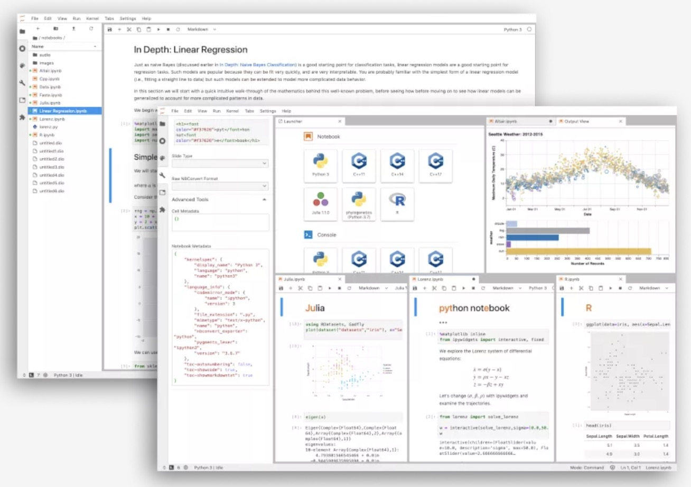
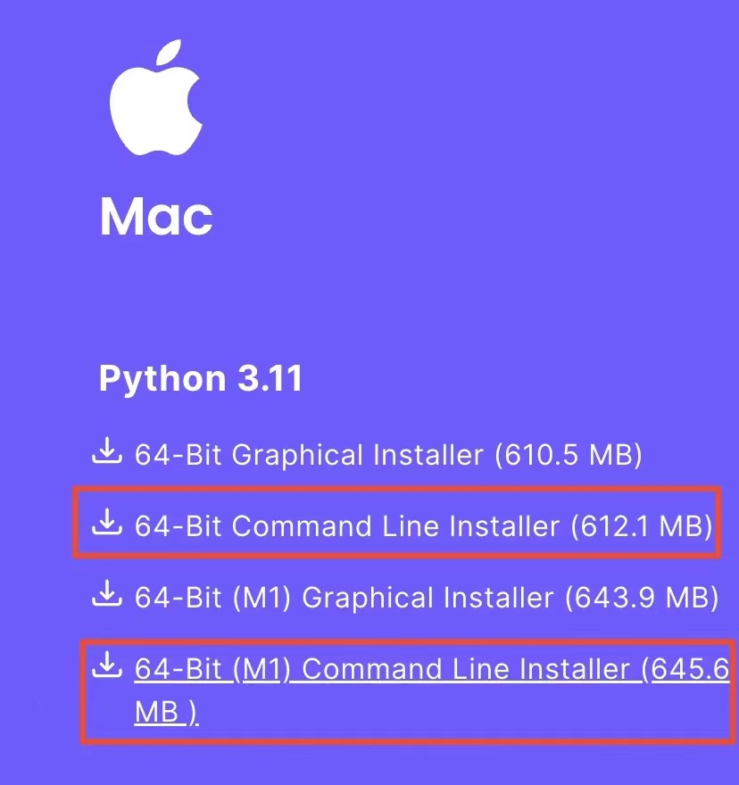
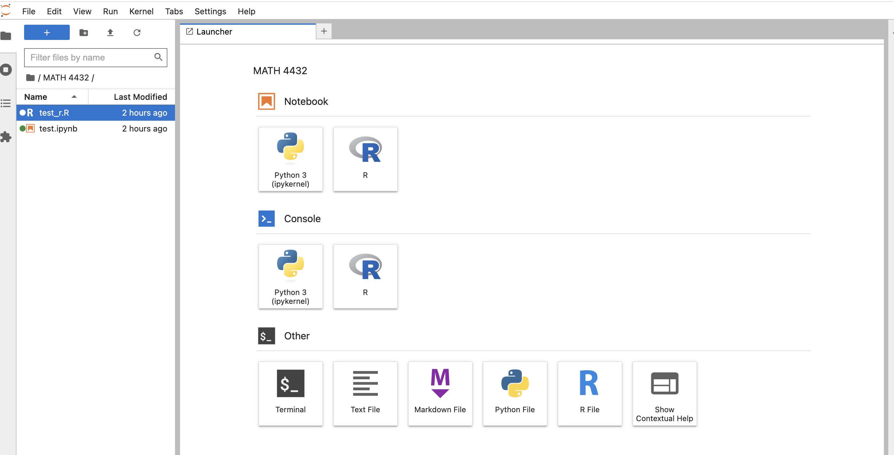
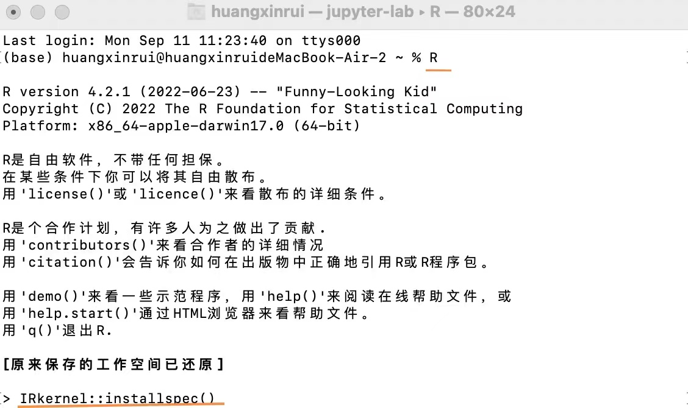
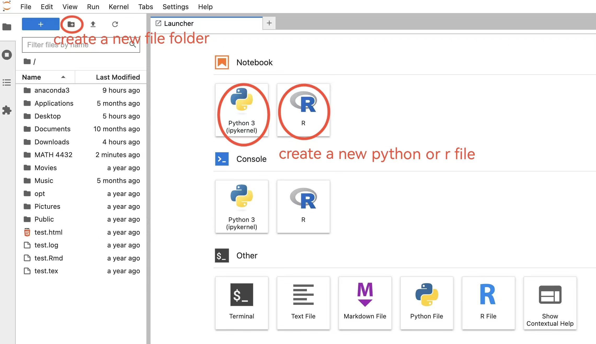
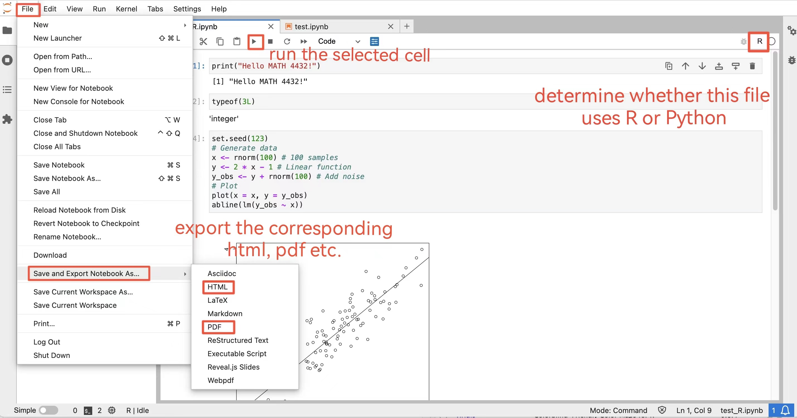
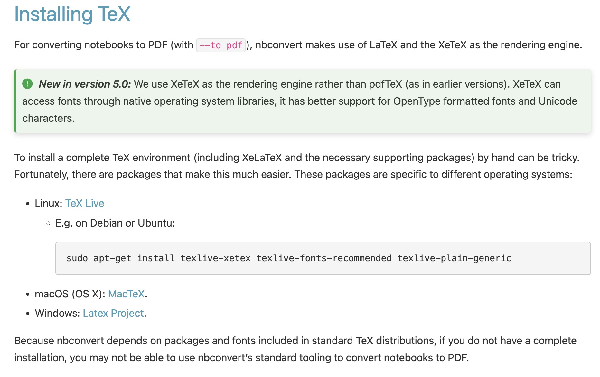
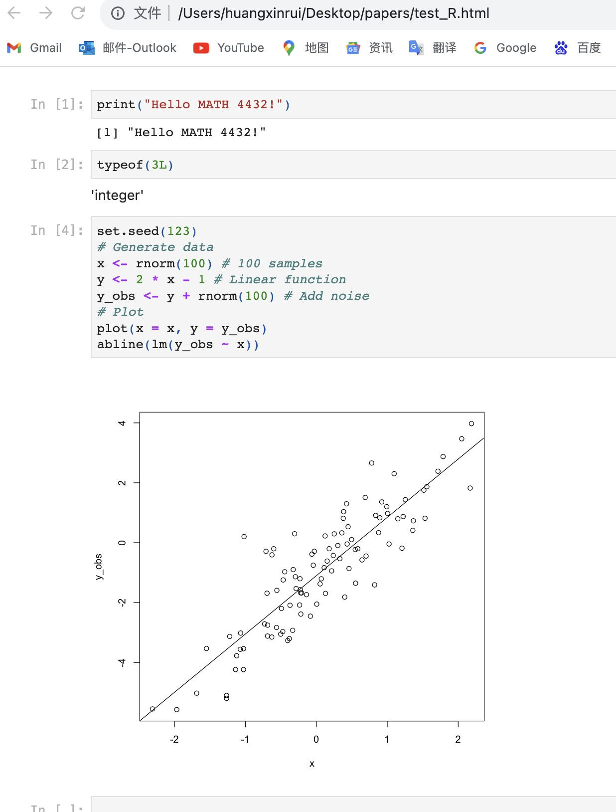
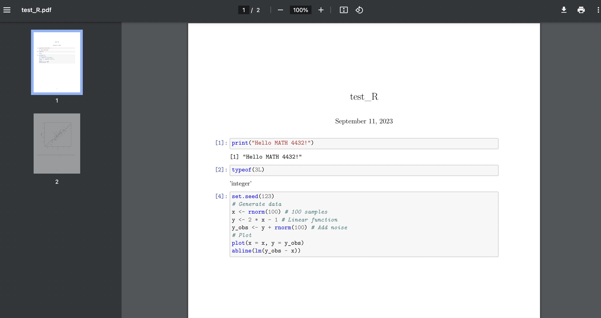

```{r setup, include = FALSE}
knitr::opts_chunk$set(
  collapse = TRUE,
  results = "asis",
  echo = TRUE,
  comment = "#>",
  out.width = "100%"
)
library(xaringanthemer)
```

```{r xaringan-themer, include=FALSE, warning=FALSE}
style_mono_accent(
  header_font_google = google_font("Josefin Slab", "600"),
  text_font_google   = google_font("Work Sans", "300", "300i"),
  code_font_google   = google_font("IBM Plex Mono")
)

style_mono_light(
  base_color = "#003366",
  link_color = "#996600",
  text_bold_color = "#996600",
  link_decoration = "underline"
)
```

```{r xaringan-panelset, echo=FALSE}
xaringanExtra::use_panelset()
```

class: inverse, center, middle

# What is JupyterLab?

---

## JupyterLab: A Next-Generation Notebook Interface

JupyterLab is the latest web-based interactive development environment for notebooks, code, and data. Its flexible interface allows users to configure and arrange workflows in data science, scientific computing, computational journalism, and machine learning. A modular design invites extensions to expand and enrich functionality.

--

JupyterLab can support **both Python and R**.

```{r out.width='50%', fig.align='center', echo=FALSE}

```

---
class: inverse, center, middle

# Now let's install it via Anaconda!

---
## First download and install Anaconda

[Anaconda Installers](https://www.anaconda.com/download#downloads)

Find the version compatible with your device

###**Attention**:

Mac users please install the **Command Line Installer** instead of **Graphical Installer**.

```{r out.width='30%', fig.align='center', echo=FALSE}

```
---

## For mac users

After installation, open the **terminal** and input **"bash (here fills in the path of the installer just downloaded)"**, as shown below.

```{r out.width='70%', fig.align='center', echo=FALSE}

```

Then press **"Enter"**. If you encounter **"y/n"**, then input **"y"**.

---
### For mac users

When you finish the previous process, you can input **"jupyter lab"** in the terminal, and it will direct you to the website of jupyter lab, which is similar to the below picture, **except for the missing R kernel**.

```{r out.width='70%', fig.align='center', echo=FALSE}

```

### For Windows users

Open the **Anaconda Navigator**, find **JupyterLab** and select **Launch**. Then you'll see the same website. 
---

class: inverse, center, middle

# Next let's add the R kernel!

---
### Add R kernel

For the procedures, you can refer to [Installing the R kernel in Jupyter Lab](https://richpauloo.github.io/2018-05-16-Installing-the-R-kernel-in-Jupyter-Lab/).

The key points are:

- Run R in **Anaconda Prompt** (for windows users) or **terminal** (for mac users);

    - Install the package **"IRkernel"** by any means;
        - You can use "devtools::install_github('IRkernel/IRkernel')" or "install.packages("IRkernel")";

    - Carry out **"IRkernel::installspec()"**.

Here we only demonstrate the process for MacOS.

```{r out.width='45%', fig.align='center', echo=FALSE}

```
---

class: inverse, center, middle

# Use JupyterLab to produce a homework file

---

## Create a new file or file folder

```{r out.width='100%', fig.align='center', echo=FALSE}

```

---

## Produce the corresponding html/pdf file

```{r out.width='110%', fig.align='center', echo=FALSE}

```

---

## Error when producing pdf

You may need to follow the guidance and [install Tex](https://nbconvert.readthedocs.io/en/latest/install.html#installing-tex). 

Then reopen JupyterLab and export again.

```{r out.width='80%', fig.align='center', echo=FALSE}

```

---

## Get the pdf/html successfully!

.pull-left[
```{r out.width='100%', fig.align='center', echo=FALSE}

```
]

.pull-right[
```{r out.width='100%', fig.align='center', echo=FALSE}

```
]

---

class: inverse, center, middle

# Thank you!

